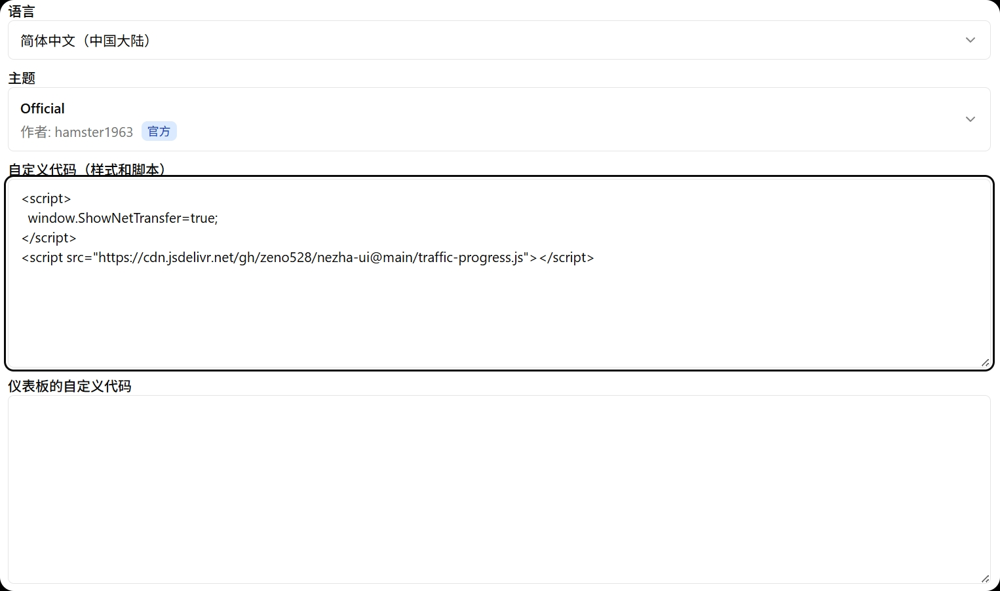

# nezha-ui

Fork 自 [ziwiwiz/nezha-ui](https://github.com/ziwiwiz/nezha-ui)，基于个人使用习惯做了调整。

## 与原版的区别

- `traffic-progress.js` 已跟进上游 `v20260803` 重构版（性能优化、防重复注入），并在其上沿用自定义颜色阈值：60%/90%，0~60% 绿色系渐变，60%~90% 转红，90% 以上深红。
- `traffic-progress-legacy.js` 为旧版备份：同样的 60%/90% 阈值，但不含上游新版的性能优化。仅在新版异常时备用。

## 使用方式

###### 后台添加
在面板 **系统设置 → 自定义代码（样式和脚本）** 中填入以下代码：



###### 自用的探针更改
```html
<meta name="referrer" content="no-referrer">
/* 自用的css格式 */
<link rel="stylesheet" href="https://cdn.jsdelivr.net/gh/zeno528/nezha-ui@main/nezha-style.css">
/* 自用的探针修改 */
<script>
    window.CustomBackgroundImage = "https://bing.img.run/rand_uhd.php"; /* 页面背景图 */
    window.CustomMobileBackgroundImage = "https://bing.img.run/rand_m.php"; /* 移动端页面背景图 */
    /* 卡片显示上下行流量 */
    // window.ShowNetTransfer = "true";
    /* 关掉人物插图 */
    window.DisableAnimatedMan = "true";
    /* 自定义描述 */
    window.CustomDesc = "v2.games";
</script>
```
###### 周期性流量进度条（新版 v20260803，阈值 60/90）
```html
/* 周期性流量进度条 */
<script>
  window.TrafficScriptConfig = {
    showTrafficStats: true,    // 显示流量统计
    insertAfter: true,         // 如果开启总流量卡片, 放置在总流量卡片后面
    interval: 60000,           // 60秒刷新缓存, 单位毫秒
    toggleInterval: 4000,      // 4秒切换流量进度条右上角内容, 0秒不切换, 单位毫秒
    duration: 500,             // 缓进缓出切换时间, 单位毫秒
    enableLog: false           // 开启日志
  };
</script>
<script src="https://cdn.jsdelivr.net/gh/zeno528/nezha-ui@main/traffic-progress.js"></script>
```
> 新版与旧版备份二选一，**不要同时加载**。

###### 周期性流量进度条（旧版备份 v20250617，阈值 60/90）
```html
/* 周期性流量进度条（旧版） */
<script>
  window.TrafficScriptConfig = {
    showTrafficStats: true,    // 显示流量统计
    insertAfter: true,         // 如果开启总流量卡片, 放置在总流量卡片后面
    interval: 60000,           // 60秒刷新缓存, 单位毫秒
    toggleInterval: 5000,      // 5秒切换流量进度条右上角内容, 0秒不切换, 单位毫秒
    duration: 500,             // 缓进缓出切换时间, 单位毫秒
    enableLog: false           // 开启日志
  };
</script>
<script src="https://cdn.jsdelivr.net/gh/zeno528/nezha-ui@main/traffic-progress-legacy.js"></script>
```
###### 哪吒详情页直接展示网络波动卡片
```html
/* 源自https://www.nodeseek.com/post-349102-1 */
<script src="https://cdn.jsdelivr.net/gh/zeno528/nezha-ui@main/netstatus-autoshow.js"></script>
```
###### 仪表板的自定义代码
```html
<link rel="stylesheet" href="https://cdn.jsdelivr.net/gh/zeno528/nezha-ui@main/nezha-dashboard.css">
<script src="https://cdn.jsdelivr.net/gh/zeno528/nezha-ui@main/nezha-dashboard.js"></script>
```
###### 页面时间修改
```html
<link rel="stylesheet" href="https://cdn.jsdelivr.net/gh/zeno528/nezha-ui@main/nezha-time.css">
```

## 致谢

- 原作者：[ziwiwiz](https://github.com/ziwiwiz/nezha-ui)
